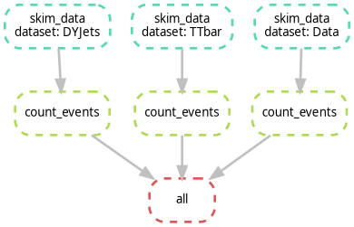
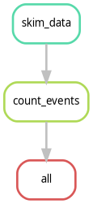

# Visualizing the Workflow

:::{tip} Questions
- How can I see the dependencies between my rules?
- What is a Directed Acyclic Graph (DAG)?
- How do I preview what Snakemake *intends* to do?
:::

:::{note} Objectives
- Use the `--dag` flag to generate a visualization of the analysis.
- Understand the difference between the Rule Graph and the File Graph.
- Use dry-runs (`-n`) to verify the execution plan.
:::

## Seeing the Big Picture

As your analysis grows from 2 rules to 20, and from 3 samples to 300, it becomes impossible to keep the entire workflow in your head. Snakemake provides built-in tools to "draw" your analysis for you.

---

## The Directed Acyclic Graph (DAG)

Snakemake represents your workflow as a **DAG**:

* **Directed**: There is a clear flow from raw data to final plots.
* **Acyclic**: There are no loops (you can't have a file that depends on its own output).
* **Graph**: A mathematical structure of nodes (rules/files) and edges (dependencies).

### Generating the DAG

To create a visualization, we tell Snakemake to generate the DAG in a format called `dot`, and then we use the `graphviz` tool (which we installed via `pixi` in the setup) to turn it into an image.

```bash
pixi run snakemake --dag | dot -Tpng > fig/dag.png
# pixi run snakemake --dag | dot -Tpdf > fig/dag.pdf   ### For PDF format
```

How to read the DAG:

- **Nodes (Boxes)**: Represent the jobs that need to be run.
- **Arrows**: Represent the flow of data.
- **Solid vs. Dashed lines**: In many viewers, a dashed border indicates that the file already exists and the job doesn't need to run.

----


## Activity: Visualizing our Scaled Workflow

1. Ensure you have the Snakefile from the previous episode (with `DYJets`, `TTbar`, `Data`, and `WJets`).

2.  Run the DAG command:

```bash
pixi run snakemake --dag | dot -Tpng > fig/dag.png
```

:::{dropdown} For macOS users
It has been reported that the command above may not work due to differences in how `dot` is handled. If you encounter issues, try the following command instead:

```bash
pixi run snakemake --dag | pixi run dot -Tpng > fig/dag.png
```

or you can run:

```bash
pixi run dot -C
pixi run snakemake --dag | pixi run dot -Tpng > fig/dag.png
```
:::

3. Open `fig/dag.png`. It should look like the following image. Notice how the branches for each dataset are parallel.



:::{warning} Challenge: Identifying the Bottleneck
Look at your DAG. If you were to run this on a machine with only **1 core**, how many steps would it take? If you had **4 cores**, how would the timing change?

:::{dropdown} Solution
With 1 core, Snakemake runs every job sequentially. With 4 cores, Snakemake can run all four `skim_data` jobs simultaneously, significantly reducing the "Wall Clock" time of your analysis. This is the power of a DAG-based system!
:::
:::

:::{note} Rule Graph vs. File Graph
If you have 1,000 samples, the `--dag` command will produce a giant PDF with 1,000 boxes, which is unreadable. To see a simplified version that only shows how the rules connect (ignoring the individual samples), use:

```bash
pixi run snakemake --rulegraph | dot -Tpng > fig/rulegraph.png
```

This is often much more useful for complex HEP analyses to ensure the logic is correct.


:::

## The Dry-Run: "Look Before You Leap"

Before you submit 1,000 jobs to a cluster, you should always perform a **Dry-Run**. This tells Snakemake to calculate the DAG and print the execution plan without actually running any commands.

```bash
pixi run snakemake -n
```

If you want more detail (like seeing the actual shell commands that will be executed), use:

```bash
pixi run snakemake -n -p
```

:::{dropdown} Did the previous command work?
If you run this command on top of a finished workflow, you should see something like:

```output
Building DAG of jobs...
Nothing to be done (all requested files are present and up to date).
```

This is expected, because all the output files already exist. If you change something in your Snakefile (like adding a new rule or changing an existing one), the dry-run will show you which jobs need to be re-run.

Alternatively, if you want to see the dry-run or the commands to execute, use:

```bash
pixi run snakemake -n -p --forceall
```
:::

:::{important} Keypoints
- **DAG**: A visual map of your analysis dependencies.
- **Dry-run (-n)**: Always perform a dry-run to verify the plan before executing.
- **Rule Graph**: A simplified visualization showing the relationship between rules rather than individual files.
:::
